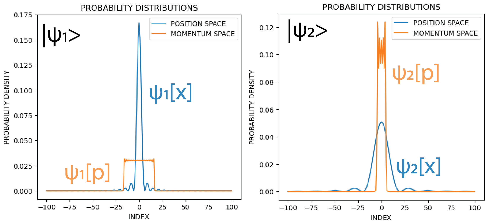

# Complementarity

This is a jupyter notebook and associated python module to explore quantum complementarity from a discrete signal processing point of view. `Complementarity' is another way to refer to the way in which the uncertainty principle applies to physical observables that satisfy a certain non-commutative algebra. Here, we are using the interpretation from quantum mechanics where we think of observable quantities as Hermitian operators that act on a space of wavefunctions. A particular wavefunction has different representations but is in its essence the same object (a direction in a Hilbert space).

This particular notebook approaches complementarity from the engineering folk-wisdom that the time and frequency spreads of the representations of a particular signal show inverse proportionalities (roughly speaking). This project tries to study this trade-off quantitatively using discrete signal processing. The representation consists of the weights at each discrete sample location. It is intended to be useful both for teaching and exploration for interested folks. 

Files:

wavefunction.py - python module containing eponymous class for treating a particular 1-dimensional discretized setup using position as well as momentum representations (and associated operators). It allows a few different function families to be studied for the complementarity of their representations. A sweep function is added to study parameter-dependent variation.

complementarity.ipynb - Jupyter notebook which uses the above module to investigate different function families for the uncertainty principle and obtain functions that saturate the lower bound.

The term `complementarity' is based on Niels Bohr's article in Philosophy of Science from 1937 (and later in Science in the 50's):

"I am afraid that the short indications to which I have been obliged to restrict myself with respect to the last and many other points of this lecture will remind you only too well that in the last resort the direct use of any word must stand in complementary relationship to an analysis of its meaning. I hope, however, that I have to some extent succeeded in giving you the impression that my attitude is in no way in conflict with our common endeavors to arrive at as great a unification of knowledge as possible by the combating of prejudices in every field of research."

## Notation and key results

We consider a 1D grid of points x = -M, -M+1, ... -1, 0, 1, ... M-1, M and the discrete delta at each of the grid points as the basis (N = 2M+1 is the total number of grid points and the dimensionality of our setup). In this case, an arbitrary wavefunction can be expressed as:

$$ | \psi \rangle = \Sigma_x \psi_x | x \rangle $$

where ket x is a position basis vector. The basis is complete and orthonormal:

$$ \langle x' | x \rangle = \delta_{x',x} $$

In order to obtain a different but equally informative representation of the same wavefunction, we consider a new basis:

$$ | p \rangle := \frac{1}{\sqrt{N}} \Sigma_x e^{2\pi j \frac{px}{N}} | x \rangle $$

where p = -M, -M+1, ... M-1, M (similar to x). Each of the p-basis wavefunctions is a complex exponential, with a frequency proportional to p. The analogy with a physical momentum can be made more precise by thinking of traveling waves, but we could have chosen to call this something like a 'wavenumber' basis as well. 

It can be verified that the representation of our wavefunction in the momentum basis is the discrete Fourier transform of the representation in the position basis:

$$ \psi_p = \langle p | \psi \rangle = \frac{1}{\sqrt{N}} \Sigma_x \psi_x e^{-2 \pi j \frac{px}{N}} $$

We find that if a particular wavefunction is narrow in one representation, it becomes widely spread in the other. This is illustrated with a wavefunction that has a sinc(x) representation in position space:

This tradeoff can be made more quantitative by considering the expectation values of the operators, and using the Cauchy Schwartz inequality (see Refs. 3 and 4 below). The position operator is:

$$ \hat{X} = \Sigma_x x | x \rangle \langle x | $$

This is a Hermitian operator and the probability for a particular x to be observed is given by the Born rule.

Considering wavefunctions that are centered at 0, the spatial variance of the state can be expressed as:

$$ \sigma_x^2 = \langle \psi | \hat{X}^2 | \psi \rangle $$

Similarly, we express the momentum operator in position space. With a bit of calculation, it can be verified that:

$$ \hat{P} = \Sigma_p p | p \rangle \langle p | = \Sigma_{x_1, x_2} | x_1 \rangle \langle x_2 | (1 - \delta_{x_i,x_j}) \frac{r^{-M}}{r-1} $$

where:

$$ r = e^{2 \pi j (x_1 - x_2) / N } $$

Then, for even zero-centered wavefunctions, the Cauchy-Schwartz inequality can be expressed as:

$$ \sigma_X^2 \sigma_P^2 = | \hat{X} | \psi \rangle |^2 | \hat{P} | \psi \rangle |^2 \ge | \langle \psi | \hat{X} \hat{P} | \psi \rangle |^2 $$

 

## References 

[1] [N. Bohr, "Causality and complementarity", Philosophy of Science, vol. 4, no. 3, July 1937](https://www.cambridge.org/core/journals/philosophy-of-science/article/abs/causality-and-complementarity/C193DEAB5C18330DD3739664761E8ECE)

[2] [N. Bohr, "On the notions of causality and complementarity", Science, Vol. 111, January 1950](https://www.science.org/doi/abs/10.1126/science.111.2873.51)

[3] [R. Shankar, "Principles of quantum mechanics", 2nd edition, Chapter 9: the Heisenberg Uncertainty Relations (pg. 237-241)]

[4] [M. A. Nielsen and I. C. Chuang, "Quantum computation and quantum information", Chapter 2: The postulates of quantum mechanics (pg. 89)]

[5] [Related work: S. Massar and P. Spindel, "Uncertainty relation for the discrete Fourier transform", Phys. Rev. Lett., 100, 190401, 2008](https://journals.aps.org/prl/abstract/10.1103/PhysRevLett.100.190401)

